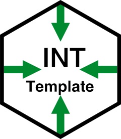

<!-- README.md is generated from README.Rmd. Please edit that file -->

# TemplateLandS: Template for Statistical Report Generation

A ready-to-use template package for creating statistical reports.

# TemplateLandS <a href="https://stheberga.github.io/TemplateLandS/"></a>


[](LICENSE)

## Description

TemplateLandS is designed to streamline the creation of statistical
reports. This package provides a ready-to-use template for generating
customizable, easy-to-read reports. It is particularly suited for
statistical analysis, including survival analysis for patient datasets,
as well as univariate and multivariate statistical analyses.

## Installation

You can install the latest version of TemplateLandS directly from GitHub
using `devtools`:

``` r
# Install devtools if not already installed
install.packages("devtools")

# Install TemplateLandS
devtools::install_github("StheBerga/TemplateLandS")
```

## Quick Start

After installing the package, you will need to restart R to access the
template. To create a new R Markdown file utilizing TemplateLandS,
navigate to File -\> New File -\> R Markdown. In the resulting window,
choose “From Template,” and then select “LandS LaTeX Report
{TemplateLandS}” from the options on the right.

## Key Features

- Ready-to-use template for statistical report generation
- Includes predefined chunks for survival analysis of patient datasets
- Supports univariate and multivariate statistical analyses
- Customizable layout and content options for your reports
- Export reports in various formats (HTML, PDF, Word)

## Documentation

<!-- For detailed documentation and tutorials, visit the [Wiki](https://github.com/StheBerga/TemplateLandS/wiki). -->

## Contributing

Contributions, bug reports, and feature suggestions are welcome! Please
open an issue or submit a pull request on the repository.

## License

TemplateLandS is distributed under the MIT license. See the
[LICENSE](https://github.com/StheBerga/TemplateLandS/blob/2e6647104c4bea7e46f28684bd4faf8f96ac06a7/LICENSE)
file for details.
